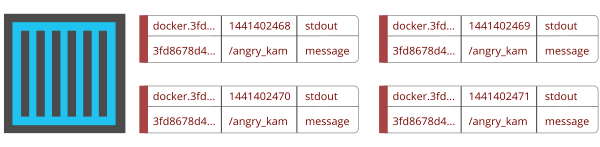
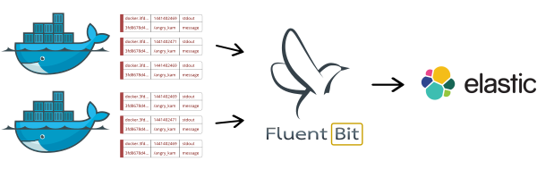

# Docker Logging with Fluent Bit and Elasticsearch

Latest versions of [Docker](http://www.docker.com) comes with a _logging layer_ feature which allows to define specific drivers that can handle the Container applications logs, specifically the ones that are send to the _standard output_ (stdout) and _standard error_ (stderr) interfaces.

Starting from Docker v1.8, it provides a [Fluentd Logging Driver](https://docs.docker.com/engine/admin/logging/fluentd/) which implements the _Forward_ protocol. [Fluent Bit](http://fluentbit.io) have native support for this protocol, so it can be used as a lightweight log collector. On this article we will demonstrate how to collect Docker logs with Fluent Bit and aggregate them back to a Elasticsearch database.

## Docker Logs

Every message than a containerized application writes to _stdout_ or _stderr_ interface, is packaged and associated with some metadata:



The records comes with the container name, container ID, interface among others. Our goal is to connect Docker logging driver with Fluent Bit so then we can send the logs to Elasticsearch:




## Requirements

In order to follow this tutorial, make sure that you have an updated Linux system, check that [Docker](http://www.docker.com) is installed and verify that [Elasticsearch](http://www.elasticsearch.com) service is up and running. For more details about how to accomplish this, check their official documentation:

- [Docker documentation](https://docs.docker.com/engine/installation/linux/)
- [Elasticsearch documentation](https://www.elastic.co/guide/en/elasticsearch/reference/current/setup.html)

## Fluent Bit Setup

[Fluent Bit](http://fluentbit.io) as a log collector have two main components: inputs and outputs. The inputs defines from where the data must be collected and the output where it should go.

> We assume Fluent Bit or TD Agent Bit is installed in your system, if not, please refer to the official documentation for [Installation](http://fluentbit.io/documentation/0.8/installation/index.html) steps.

Create a new Fluent Bit configuration file called _docker\_to\_es.conf_ and add the the following content:

```python
[SERVICE]
    Flush        5
    Daemon       Off
    Log_Level    debug

[INPUT]
    Name   forward
    Listen 0.0.0.0
    Port   24224

[OUTPUT]
    Name  es
    Match *
    Host  192.168.2.3
    Port  9200
    Index fluentbit
    Type  docker
```

The configuration above says the core will try to flush the records every 5 seconds. It will listen for _Forward_ messages on TCP port 24224 and deliver them to a Elasticsearch service located on host 192.168.2.3 and TCP port 9200. By default it will match all incoming records.

Note that Elasticsearch requires the _Index_ and _Type_, this can be confusing if you are new to Elasticsearch, if you have used some relational database before, they can be compared to the _database_ and _table_ concepts.

Now launch [Fluent Bit](http://fluentbit.io) with the configuration file just created:

```bash
$ fluent-bit -c docker_to_es.conf
[2016/07/07 16:26:24] [debug] [service] loading input: forward
Fluent-Bit v0.8.3
Copyright (C) Treasure Data

[2016/07/07 16:26:24] [ info] starting engine
[2016/07/07 16:26:24] [debug] [in_fw] Listen='0.0.0.0' TCP_Port=24224
[2016/07/07 16:26:24] [ info] [in_fw] binding 0.0.0.0:24224
[2016/07/07 16:26:24] [debug] [es] host=192.168.2.3 port=9200 index=fluentbit type=docker
[2016/07/07 16:26:24] [debug] [router] input=forward.0 'DYNAMIC TAG'
```

Leave that terminal open so you can see the debug messages to confirm how the data is moving on.

## Elasticsearch Test

Assuming your Elasticsearch service is up, please perform a connection test. Adjust the Host and TCP port as required:

```bash
$ curl -X GET http://192.168.2.3:9200/
{
  "name" : "Janus",
  "cluster_name" : "elasticsearch",
  "version" : {
    "number" : "2.3.3",
    "build_hash" : "218bdf10790eef486ff2c41a3df5cfa32dadcfde",
    "build_timestamp" : "2016-05-17T15:40:04Z",
    "build_snapshot" : false,
    "lucene_version" : "5.5.0"
  },
  "tagline" : "You Know, for Search"
}
```

## Docker Setup

For this test we will use an Ubuntu image for our container, get the image with:

```bash
$ docker pull ubuntu
```

After a few minutes, you should get the ubuntu base image:

```bash
$ docker images
REPOSITORY    TAG       IMAGE ID        CREATED         SIZE
ubuntu        latest    0f192147631d    8 days ago      132.7 MB
```

## Running the Docker Container

The following command will run a simple _echo_ command in a container that prints out a message to the standard output (stdout). Pay attention to the extra given options which specify where the logs should go:

```
$ docker run -t -i --log-driver=fluentd ubuntu echo "Hello Fluent Bit!"
```

> When specifying the _fluentd_ driver, it will assume that will forward the logs to localhost on TCP port 24224. If you want to change that value you can use the __--log-opt fluentd-address=host:port__ option

## Query Elasticsearch

After five seconds you will be able to check the records in your Elasticsearch database, do the check with the following command:

```
$ curl -X GET 'http://192.168.2.3:9200/fluentbit/_search'
{"took":1,"timed_out":false,"_shards":{"total":5,"successful":5,"failed":0},"hits":{"total":1,"max_score":1.0,"hits":[{"_index":"fluentbit","_type":"docker","_id":"AVXHyv2XrpN9Bg1zuGCD","_score":1.0,"_source":{"date":1467935812,"container_id":"5c4bf54b660ae27245556b9d649d487dd930581ba7d05b59f6674d4e0e737521","container_name":"/sleepy_lalande","source":"stdout","log":"Hello Fluent Bit!\r"}}]}}
```

The response will be a JSON message with the records found, the above example have the relevant _source field with:

```json
{
    "date": 1467935812,
    "container_id": "5c4bf54b660ae27245556b9d649d487dd930581ba7d05b59f6674d4e0e737521",
    "container_name": "/sleepy_laland\e",
    "source": "stdout",
    "log": "Hello Fluent Bit!\r"
}
```

At this point everything looks pretty good. The next step would be to use [Kibana](https://www.elastic.co/products/kibana) to visualize the logs. Enjoy!
